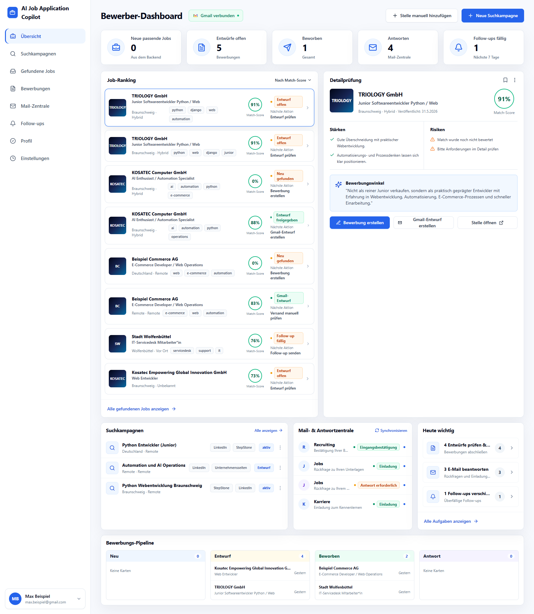
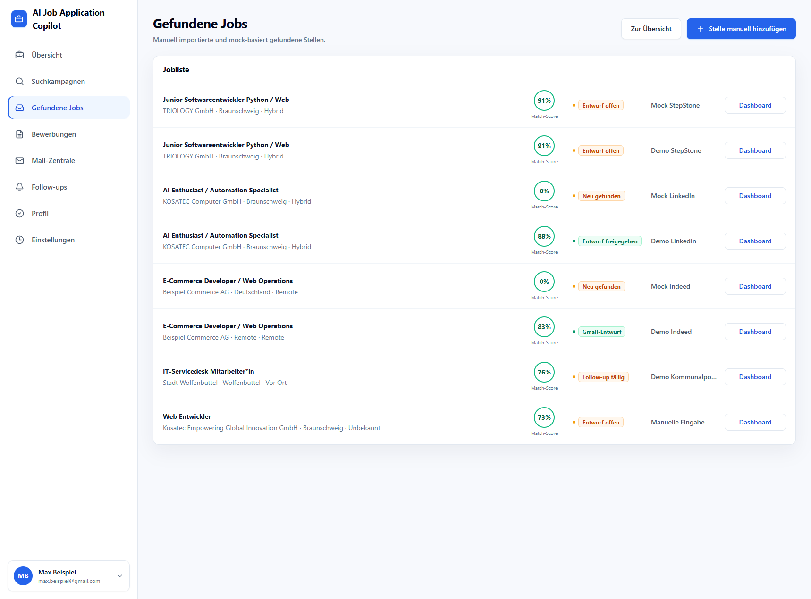
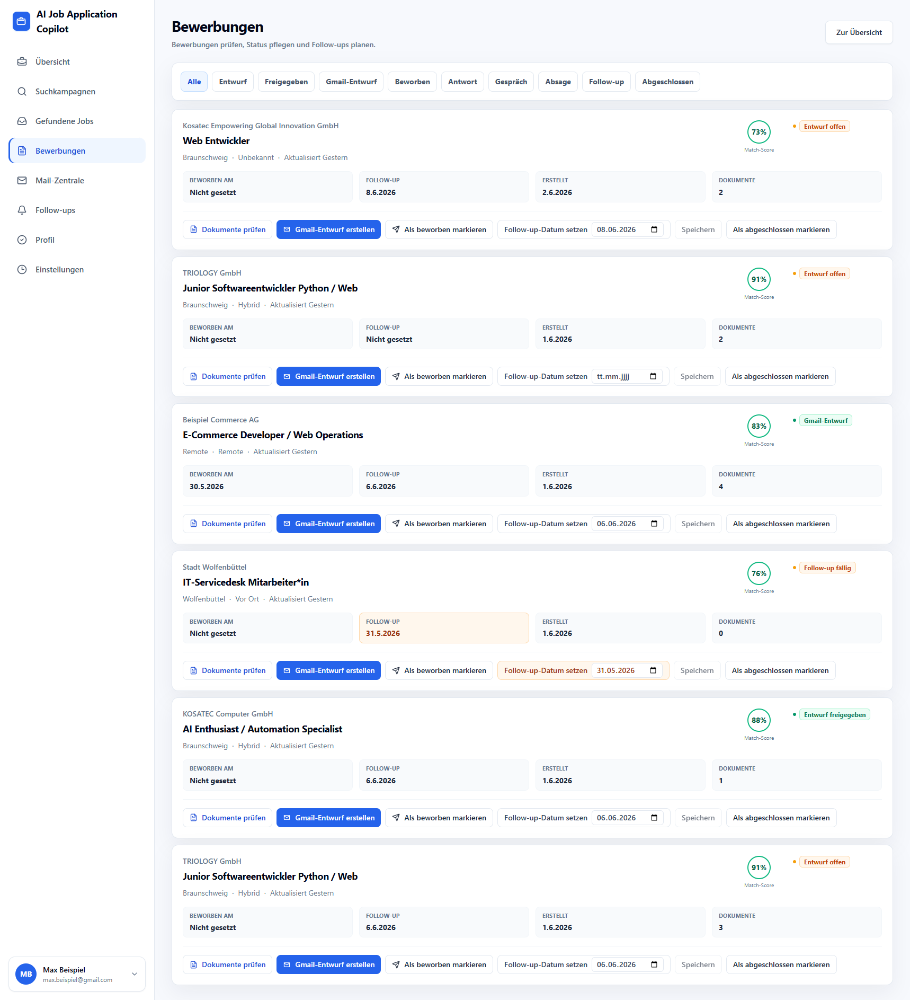
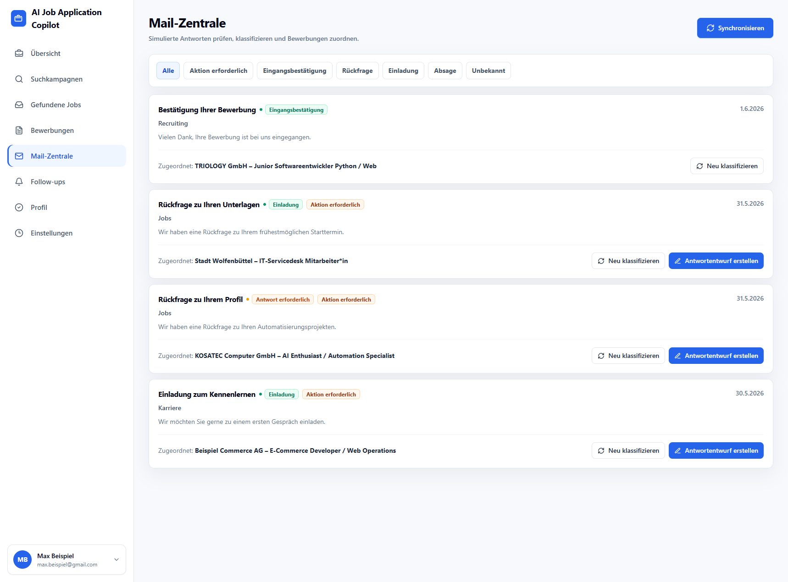
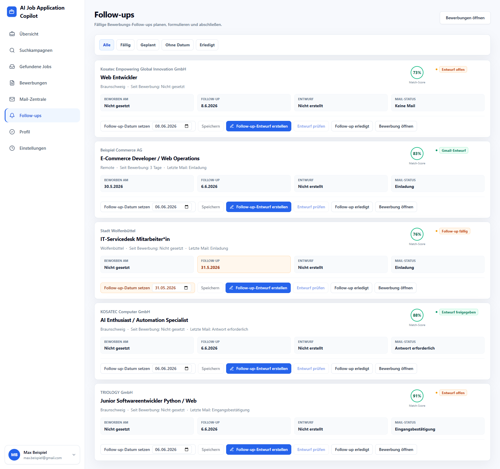
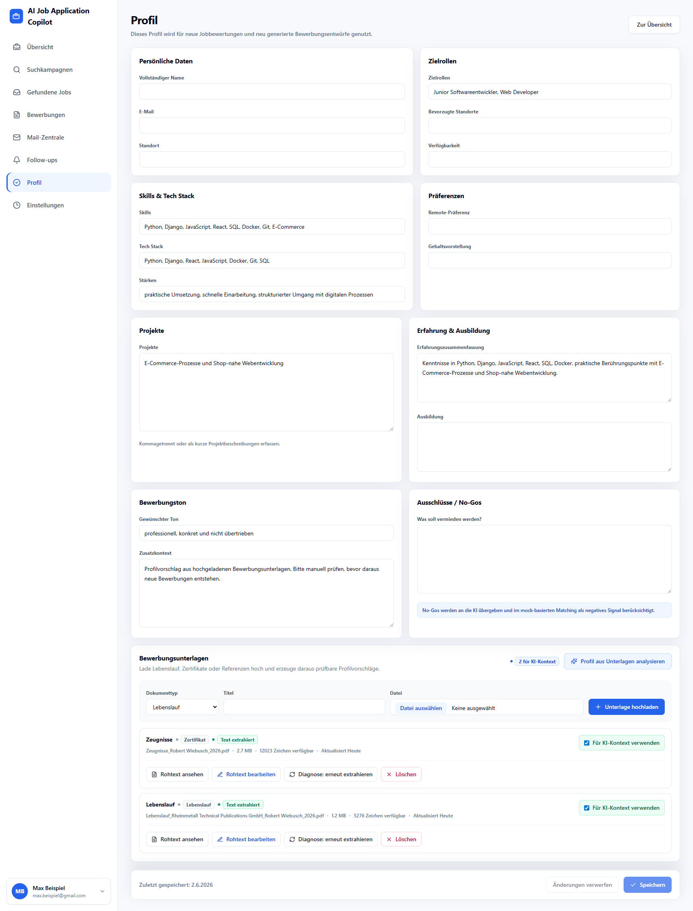

# AI Job Application Copilot

Fullstack MVP foundation for a human-in-the-loop job application assistant.

The project includes a Django REST API with deterministic mock AI services, SQLite local development, Django Admin, demo data, and a React/Vite/Tailwind dashboard frontend connected to the API.

## Structure

```text
backend/
frontend/
README.md
```

## Backend Setup

```bash
cd backend
python -m venv .venv
source .venv/bin/activate
pip install -r requirements.txt
cp .env.example .env
python manage.py migrate
python manage.py seed_demo_data
python manage.py runserver
```

If your system exposes Python as `python3`, use `python3 -m venv .venv`.

The API runs at `http://127.0.0.1:8000/api/`.

Keep this terminal running while using the frontend.

AI services use a provider selector:

```text
AI_PROVIDER=mock
OPENAI_API_KEY=
OPENAI_MODEL=
```

The deterministic mock provider is the default. With `AI_PROVIDER=openai`,
job matching, application document generation, and follow-up drafting can call
OpenAI when `OPENAI_API_KEY` and `OPENAI_MODEL` are set. Email classification
can also call OpenAI and falls back to mock behavior on errors.
If OpenAI configuration is missing, parsing/validation fails, or the provider
errors, the backend logs a warning and falls back to mock. API keys are not logged.

## Frontend Setup

```bash
cd frontend
npm install
cp .env.example .env
npm run dev
```

The frontend runs at `http://localhost:5173/` and calls the backend from:

```text
VITE_API_BASE_URL=http://127.0.0.1:8000
```

If the backend is unavailable, the dashboard shows a clean error state instead of crashing.

The sidebar uses React Router routes for Übersicht, Suchkampagnen, Gefundene Jobs, Bewerbungen, Mail-Zentrale, Follow-ups, Profil, and Einstellungen. Einstellungen remains a placeholder; the core MVP workflow pages use backend data.

## Current Features

- Manual job import from the dashboard and `Gefundene Jobs` page. Imported jobs are stored through the backend and immediately evaluated with the deterministic mock matching service.
- Campaign mock search with automatic deterministic job matching.
- Human-in-the-loop application document review, editing, and approval.
- Simulated Gmail draft creation after explicit E-Mail document approval.
- `Bewerbungen` page with status filters, quick actions, follow-up dates, notes, and links into the document review/detail view.
- `Mail-Zentrale` page with mock sync, reclassification, application linking, and explicit status-update suggestions.
- `Follow-ups` page with due/planned follow-ups, German follow-up drafts, and explicit review/approval.
- `Profil` page with an editable candidate profile used for future job matching and newly generated application documents.
- Candidate document upload for CVs, certificates, references, templates, and other application material with local text extraction where possible.
- AI-assisted profile suggestions from uploaded documents with explicit review and safe apply behavior.

## Screenshots

### Bewerber-Dashboard



### Gefundene Jobs



### Bewerbungen



### Mail-Zentrale



### Follow-ups



### Profil



## Not Implemented Yet

- No real Gmail API integration.
- No real job board scraping.
- No real email sending.
- No authentication or multi-user profile management.

See `TESTING.md` for the manual MVP test checklist.

## Run Backend And Frontend Together

Terminal 1:

```bash
cd backend
source .venv/bin/activate
python manage.py migrate
python manage.py seed_demo_data
python manage.py runserver
```

Terminal 2:

```bash
cd frontend
npm install
cp .env.example .env
npm run dev
```

Open:

```text
http://localhost:5173/
```

The frontend uses these API calls:

- `GET /api/dashboard/summary/`
- `GET /api/jobs/`
- `POST /api/jobs/manual-import/`
- `GET /api/campaigns/`
- `GET /api/applications/`
- `GET /api/applications/{id}/`
- `PATCH /api/applications/{id}/`
- `GET /api/mail/messages/`
- `GET /api/profile/`
- `PATCH /api/profile/`
- `GET /api/profile/documents/`
- `POST /api/profile/documents/`
- `GET /api/profile/documents/{id}/`
- `PATCH /api/profile/documents/{id}/`
- `DELETE /api/profile/documents/{id}/`
- `POST /api/profile/suggest-from-documents/`
- `GET /api/profile/suggestions/`
- `GET /api/profile/suggestions/{id}/`
- `POST /api/profile/suggestions/{id}/apply/`
- `POST /api/profile/suggestions/{id}/dismiss/`
- `POST /api/jobs/{id}/create-application/`
- `POST /api/applications/{id}/generate-documents/`
- `POST /api/applications/{id}/generate-follow-up/`
- `POST /api/applications/{id}/approve-document/`
- `PATCH /api/applications/{id}/documents/{document_id}/`
- `POST /api/applications/{id}/create-gmail-draft/`
- `POST /api/applications/{id}/mark-applied/`
- `POST /api/campaigns/`
- `POST /api/campaigns/{id}/run/`
- `POST /api/mail/sync/`
- `PATCH /api/mail/messages/{id}/`
- `POST /api/mail/messages/{id}/classify/`

## Main API Endpoints

```text
GET  /api/dashboard/summary/
GET  /api/profile/
PATCH /api/profile/
GET  /api/profile/documents/
POST /api/profile/documents/
GET  /api/profile/documents/{id}/
PATCH /api/profile/documents/{id}/
DELETE /api/profile/documents/{id}/
POST /api/profile/suggest-from-documents/
GET  /api/profile/suggestions/
GET  /api/profile/suggestions/{id}/
POST /api/profile/suggestions/{id}/apply/
POST /api/profile/suggestions/{id}/dismiss/

GET  /api/campaigns/
POST /api/campaigns/
GET  /api/campaigns/{id}/
PATCH /api/campaigns/{id}/
POST /api/campaigns/{id}/run/

GET  /api/jobs/
GET  /api/jobs/{id}/
POST /api/jobs/manual-import/
POST /api/jobs/{id}/evaluate/
POST /api/jobs/{id}/create-application/

GET  /api/applications/
GET  /api/applications/{id}/
PATCH /api/applications/{id}/
POST /api/applications/{id}/generate-documents/
POST /api/applications/{id}/generate-follow-up/
POST /api/applications/{id}/approve-document/
PATCH /api/applications/{id}/documents/{document_id}/
POST /api/applications/{id}/create-gmail-draft/
POST /api/applications/{id}/mark-applied/

GET  /api/mail/messages/
PATCH /api/mail/messages/{id}/
POST /api/mail/sync/
POST /api/mail/messages/{id}/classify/
```

## Mock Behavior

- Campaign runs create realistic mock job postings.
- Job evaluation creates deterministic `JobMatch` entries.
- Application document generation creates German cover letter and email drafts.
- Candidate profile data from `/api/profile/` and applied document-derived profile suggestions are used for new matching and newly generated documents; existing generated documents are not regenerated automatically.
- Uploaded profile documents are stored locally under `backend/media/`, which is ignored by git.
- AI-like behavior is routed through `backend/ai_services/providers/mock.py`.
- `backend/ai_services/providers/openai_provider.py` can use OpenAI for job matching, application documents, follow-up drafts, and email classification when explicitly configured.
- Gmail draft creation is simulated only.
- Mail sync is mock-based. Email classification is mock-based by default and can use OpenAI when explicitly configured.
- No real job board scraping, Gmail API, email sending, or secrets are used.

## Candidate Document Uploads

The `Profil` page supports uploading PDF, DOCX, and TXT files up to 10 MB.
The main workflow is structured profile analysis, not manual copying of raw
extracted text:

```text
Unterlagen hochladen -> Profil aus Unterlagen analysieren -> Vorschläge prüfen/übernehmen -> Profil ergänzen
```

Text extraction remains a local best-effort helper for analysis:

- TXT files are read directly.
- PDF extraction uses `pypdf` and works only for PDFs with embedded text.
- DOCX extraction uses `python-docx`.
- OCR is not implemented.

Users can choose which documents are preferred for AI context. Profile
suggestions use the best available document information: extracted text when
available, plus metadata such as title, document type, original filename, notes,
and extraction diagnostics. Extraction failure does not block profile analysis.
Uploaded files themselves are never sent to OpenAI.

`POST /api/profile/suggest-from-documents/` creates structured suggestions from
selected or AI-context-enabled documents. Suggestions do not overwrite the
profile automatically. The user must apply them explicitly; the backend then
fills empty scalar fields, merges list fields, and appends summary/context text
only when it is not already present. OCR and Vision-based document understanding
are not implemented yet.

## Testing OpenAI Provider

OpenAI usage is optional and disabled by default.

1. Install backend requirements after pulling changes:

   ```bash
   cd backend
   source .venv/bin/activate
   pip install -r requirements.txt
   ```

   The OpenAI provider requires `openai>=1.40.0` for structured JSON output
   support used by this MVP.

2. Set local `.env` values:

   ```text
   AI_PROVIDER=openai
   OPENAI_API_KEY=your-local-key
   OPENAI_MODEL=gpt-4o-mini
   ```

3. Start the backend and evaluate a job, generate documents, or classify mail:

   ```bash
   python manage.py runserver
   ```

   Then call `POST /api/jobs/{id}/evaluate/`,
   `POST /api/applications/{id}/generate-documents/`, or
   `POST /api/applications/{id}/generate-follow-up/`, or
   `POST /api/mail/messages/{id}/classify/` from the frontend flow or an API
   client.

4. Test provider configuration directly:

   ```bash
   python manage.py test_ai_provider
   ```

   This prints the selected provider, whether OpenAI config is detected,
   whether fallback was used, the safe fallback reason, and a few extracted
   profile suggestion fields from a sample CV-like text.

Job matching, application document generation, follow-up drafting, and profile
suggestions send the stored candidate profile, selected extracted document text,
and job or application context to OpenAI only when `AI_PROVIDER=openai`. Email
classification sends only sender, subject, and body in that same mode. Generated
responses are validated as structured JSON and fall back to the mock provider on
errors.

Troubleshooting profile suggestions:

- Restart the Django backend after changing `.env`.
- If the suggestion modal shows `Analyse durch: Mock`, OpenAI was not used.
- Run `python manage.py test_ai_provider` from `backend/` to inspect the
  selected provider and fallback reason.
- Common causes are `AI_PROVIDER=mock`, missing `OPENAI_API_KEY`, missing
  `OPENAI_MODEL`, an outdated or missing OpenAI SDK, an OpenAI API error, no
  output text, a JSON parse error, or structured-output validation failure.
- The modal shows a safe fallback reason when OpenAI was requested but mock
  suggestions were used.
- API keys are never logged or returned by the API.

## Demo Data

`python manage.py seed_demo_data` creates:

- TRIOLOGY GmbH / Junior Softwareentwickler Python / Web / 91%
- KOSATEC Computer GmbH / AI Enthusiast / Automation Specialist / 88%
- Beispiel Commerce AG / E-Commerce Developer / Web Operations / 83%
- Stadt Wolfenbüttel / IT-Servicedesk Mitarbeiter*in / 76%
- 2 search campaigns
- a demo candidate profile
- 3 email messages
- several applications with different statuses
- status events and draft documents

## Admin

Django Admin is enabled at:

```text
http://127.0.0.1:8000/admin/
```

Create a local admin user with:

```bash
python manage.py createsuperuser
```
